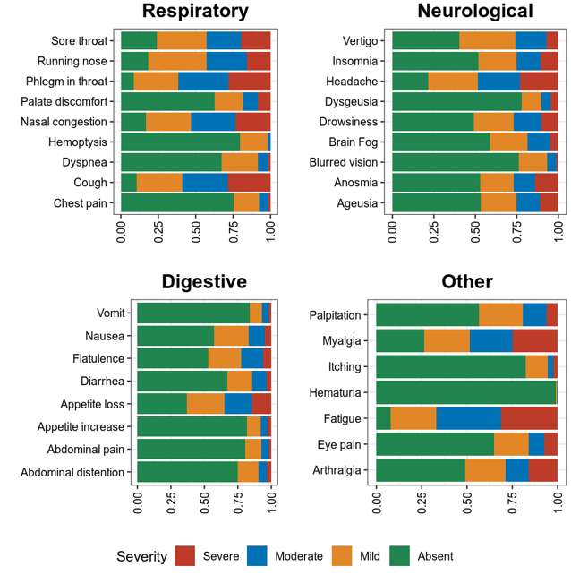
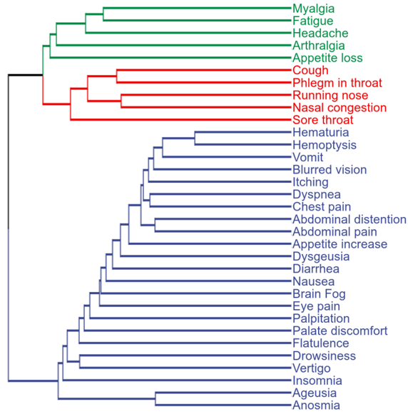

A COVID-19 survey in China after ending of restriction.
**a**. STAligner first normalizes the expression profiles for all spots and constructs a spatial neighbor network using the spatial coordinates. STAligner further employs a graph attention auto-encoder neural network to extract spatially aware embedding, and constructs the spot triplets based on current embeddings to guide the alignment process by attracting similar spots and discriminating dissimilar spots across slices. STAligner introduces the triplet loss to update the spot embedding to reduce the distance from the anchor to positive spot, and increase the distance from the anchor to negative spot. The triplet construction and auto-encoder training are optimized iteratively until batch-corrected embeddings are generated. **b**. STAligner can be applied to integrate ST datasets to achieve alignment and simultaneous identification of spatial domains from different biological samples in (a), technological platforms (I), developmental (embryonic) stages (II), disease conditions (III) and consecutive slices of a tissue for 3D slice alignment (IV).
=============================================
In Dec 2022, the COVID-19 restriction was end.

We conduct this on-line survey to measure the characteristics to measure the characteristics of COVID-19 patients in China. 

Symptom spectrum of COVID-19:

Cluster of COVID-19 symptoms:

Regional distribution of COVID-19 syndromes:
.. image:: fig3.png
   :width: 600

Regional distribution of COVID-19 symptoms:
.. image:: fig4.png
   :width: 600

Data and code
=======================
Our questionaire data is available and the analysis code is also provied. 
.. toctree::
   :maxdepth: 1
   Data
   Code

Comments and feedbacks
=======================
Feel free to contact me via zhanghaoyang0@hotmail.com

====================================================================================================================================================

.. toctree::
   :maxdepth: 1
   
   Tutorial_DLPFC
   Tutorial_Cross_Platforms
   Tutorial_3D_alignment
   
   
Overview of STAligner
========================     
   
    
**a**. STAligner first normalizes the expression profiles for all spots and constructs a spatial neighbor network using the spatial coordinates. STAligner further employs a graph attention auto-encoder neural network to extract spatially aware embedding, and constructs the spot triplets based on current embeddings to guide the alignment process by attracting similar spots and discriminating dissimilar spots across slices. STAligner introduces the triplet loss to update the spot embedding to reduce the distance from the anchor to positive spot, and increase the distance from the anchor to negative spot. The triplet construction and auto-encoder training are optimized iteratively until batch-corrected embeddings are generated. **b**. STAligner can be applied to integrate ST datasets to achieve alignment and simultaneous identification of spatial domains from different biological samples in (a), technological platforms (I), developmental (embryonic) stages (II), disease conditions (III) and consecutive slices of a tissue for 3D slice alignment (IV).

   
Installation
============ 
First clone the repository.

.. code-block:: python

   git clone https://github.com/zhoux85/STAligner.git
   cd STAligner-main

It's recommended to create a separate conda environment for running STAligner:

.. code-block:: python

   #create an environment called env_STAligner
   conda create -n env_STAligner python=3.8

   #activate your environment
   conda activate env_STAligner

Install all the required packages.

.. code-block:: python

   pip install -r requiements.txt

The use of the mclust algorithm requires the rpy2 package and the mclust package. See https://pypi.org/project/rpy2/ and https://cran.r-project.org/web/packages/mclust/index.html for detail.	
	
Install STAligner.
	
.. code-block:: python

   python setup.py build
   python setup.py install

   
Citation
========
Xiang Zhou, Kangning Dong, and Shihua Zhang. "Integrating spatial transcriptomics data across different conditions, technologies, and developmental stages". bioRxiv, 2022.
